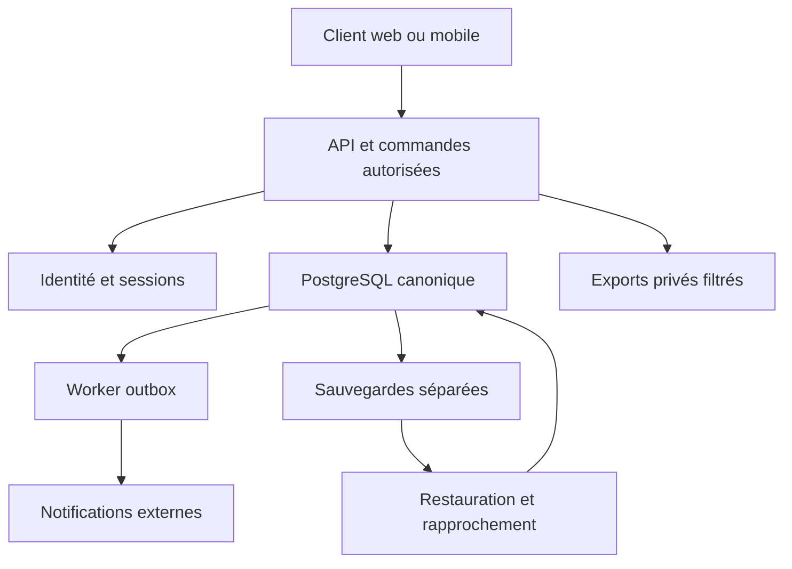

# Architecture cible et contrats à verrouiller

**Révision 2.0.** Construction neuve confirmée. Les options de réutilisation mentionnées historiquement sont remplacées par D01. Le monolithe modulaire reste une proposition à figer dans C00. La chaîne d’assurance H00 doit être isolée du code candidat ; voir [la méthode](../07_Construction_IA/METHODE_ET_GOUVERNANCE.md).

Proposition pour un démarrage neuf, conditionnée par C00. Aucun ancien client n’est présumé réutilisé ; le nouveau client sera réalisé selon les contrats adoptés.

## Frontières des composants

Un monolithe modulaire expose des commandes ; modules métier en fonctions/services séparés, accès aux données transactionnel. Le worker peut tourner dans un processus distinct avec le même dépôt, la même image versionnée et des permissions réduites. L'interface ne parle pas directement aux tables financières. Auth gérée possible, mais règles de groupe évaluées dans l'API et non dans un JWT durable.

Client et API sous une même origine lorsque possible : cookies de session HttpOnly/Secure, contrôle CSRF et politique CORS fermée. Sur mobile natif, tokens dans stockage système protégé ; même API canonique. Utiliser un domaine détenu par l'entreprise, pas un compte personnel du développeur.

## Invariants de données

- XAF entier ; proposer plafond par montant de 1 000 000 000 XAF et plafond total compatible avec l'entier sûr JSON. Plafonds à approuver et testés avant G0. Pas de floats pour argent ni conversion de devise.
- RLS complémentaire au serveur. Le rôle applicatif ne possède pas les tables, ne dispose ni de superuser ni de BYPASSRLS. Les relations portent `(group_id, object_id)` ou un équivalent démontré. Le propriétaire et certains rôles privilégiés peuvent contourner RLS : tester les rôles réellement utilisés. [PostgreSQL RLS](https://www.postgresql.org/docs/current/ddl-rowsecurity.html).
- Commande : authentification → droits actuels → registre d'idempotence → verrous → préconditions → événement/projection/outbox atomiques → commit → réponse. Politique de rejeu ancien : ne jamais recréer ; résultat filtré ou conflit explicite.
- Sous verrou : disponible à déclarer = dû − réservations actives ; restant dû affiché = dû − validé net. Un rejet libère la réservation ; une compensation coordonne le remplacement. Une écriture financière ne sort jamais seule de sa transaction.
- Snapshot de règles immuable ; toutes les personnes concernées acceptent la version initiale. À l'ouverture d'un vote, figer les électeurs. Vérifier aussi l'éligibilité actuelle à l'acte sans recalculer le dénominateur en silence.
- L'horloge serveur décide ; Africa/Douala affiche les échéances. Bords mensuels et années bissextiles couverts par fixtures.

## Démarrage des rôles

État configuration : le créateur invite et propose une liste de fonctions. Les nommés acceptent ; les membres acceptent les règles contenant cette liste. Au démarrage le serveur vérifie personnes distinctes et suppléants, puis crée les affectations actives. Aucun fondateur ne s'accorde un droit d'approbation universel. Après démarrage, toute modification suit le circuit à approbateur distinct. Les cas sans quorum humain restent bloqués.

## Journal et preuves

Schéma d'événement et profil de canonicalisation RFC 8785 figés par ADR ; choisir un hash de genèse explicite, par exemple 64 zéros, et inclure groupe, séquence, type, version et précédent. Restriction aux nombres entiers sûrs et absence de clés dupliquées au parseur. Exclure seulement le champ de son propre hash. Ne pas réimplémenter approximativement JCS à partir d'un simple tri de clés. [RFC 8785](https://www.rfc-editor.org/rfc/rfc8785).

Les projections sont reconstruisibles ; conserver compatibilité des versions de charges et migrations de replay testées. Les points de contrôle sont copiés dans un stockage à contrôle d'accès distinct du rôle applicatif ; cette mesure ne devient une signature qu'avec clés et processus appropriés. Aucun journal ne doit stocker inutilement nom complet, téléphone ou texte privé.

## Commandes complémentaires à définir dans OpenAPI

`POST /groups/{id}/role-nominations`, `/role-nominations/{id}/acceptances`, `/groups/{id}/role-change-requests`, `/role-change-requests/{id}/approvals`, `/groups/{id}/pauses`, `/memberships/{id}/departure-requests`, `/groups/{id}/delegations`, `/proposals/{id}/closures`, `/proposals/{id}/cancellations`, `/disputes/{id}/reopenings`, `/disbursements/{id}/reversal-requests`, `/disbursements/{id}/reversals`, `/rounds/{id}/closures`, `GET /commands/{id}`. Toutes sont préfixées `/v1`. Les routes futures ne sont pas exposées en production avant leur porte.

Les formes de requête, codes métier, versions attendues et politiques de non-divulgation doivent être définis par C00 puis les composants propriétaires. Un contrat OpenAPI généré depuis le code ne suffit pas : tester aussi la compatibilité avec le contrat approuvé. Retenir OpenAPI 3.1.1 comme baseline explicitement choisie, sans prétendre qu'il s'agit de la dernière version. [Spécification](https://spec.openapis.org/oas/v3.1.1.html).

## Évolution sans surarchitecture

Extraire un service seulement si sa charge, disponibilité, réglementation ou responsabilité opérationnelle justifie la séparation. L'IA, le paiement et le scoring sont des extensions cloisonnées ; ni broker supplémentaire ni base vectorielle n'est nécessaire au registre V1. L'événement métier demeure la référence même si une notification, une métrique ou une réponse IA échoue.
